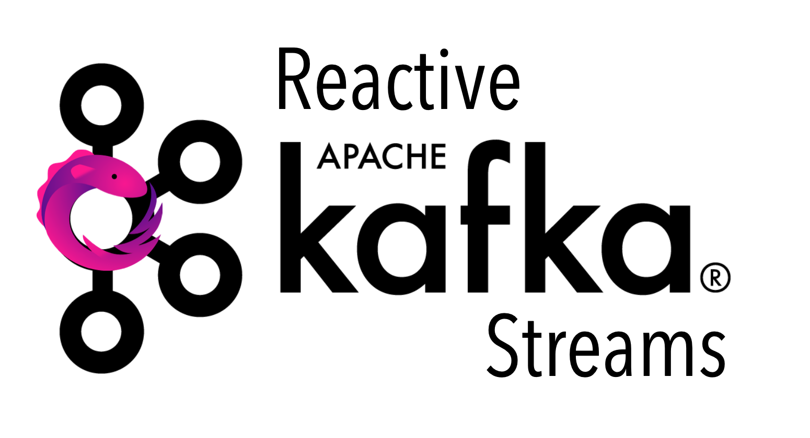

<div align="center">
<h1> ts-reactivekafka </h1>

_Typesafe & reactive Kafka Subjects made with Typescript, KafkaJS and RxJS._


</div>

## Quickstart

```sh
npm i ts-reactivekafka
```

```typescript
import rxkafka from "ts-reactivekafka";
import { tap } from "rxjs/operators";

(async () => {
  let kafkaConfig = {
    kafkaHost: process.env.KAFKA_HOST || "url:9092",
    serviceId: "test",
    logAllEvents: true,
    ssl: true,
    sasl: {
      mechanism: "plain",
      username: process.env.KAFKA_USER || "xxuser",
      password: process.env.KAFKA_PASS || "xxapitoken",
    },
  };

  let kafka = rxkafka({
    ...kafkaConfig,
    consumerConfig: {
      topics: ["topicA", "topicB", "topicC"],
      consumerId: "testConsumer",
    },
    producerConfig: {
      topics: ["target"],
    },
  });

  kafka.consumer
    .getSubject()
    .pipe(
      tap((event) => console.log(event)) // rxjs operators
    )
    .subscribe(kafka.producer.getSubject());
})();
```

## Singleton Pattern

The code follows a Singleton Pattern in which an optional consumer and producer instance are made available given the respective consumer and producer configurations and given a general Kafka config. The only public method for both instances is _getSubject()_ which returns the RxJs Subject (a multicasted observable). The subjects are typed as follows:

```typescript
type Event = {
	key?: string | null
	value: any
	partition?: number
	headers?: IHeaders
	timestamp?: string
}

Subject<{topic: string, message: Event}>
```

Since, in Typescript, no basic JSON type exists _yet_ the value is typed as any. It is important however that the value of the Kafka messages are JSON strings (are JSON parseable).

## Reactive Operators

RxJs offers a vast range operators in which developers can construct fast & flexible functionally reactive programming constructs.
A good overview of the operators can be found here:

- https://www.learnrxjs.io/learn-rxjs/operators
- https://rxmarbles.com/

## Optimized module thanks to Vercel Ncc

[Vercel's ncc](https://github.com/vercel/ncc) provides NPM developers with the ultimate NPM module compilation toolkit:

- Publish minimal packages to npm
- Only ship relevant app code to serverless environments
- Don't waste time configuring bundlers
- Generally faster bootup time and less I/O overhead
- Compiled language-like experience (e.g.: go)
